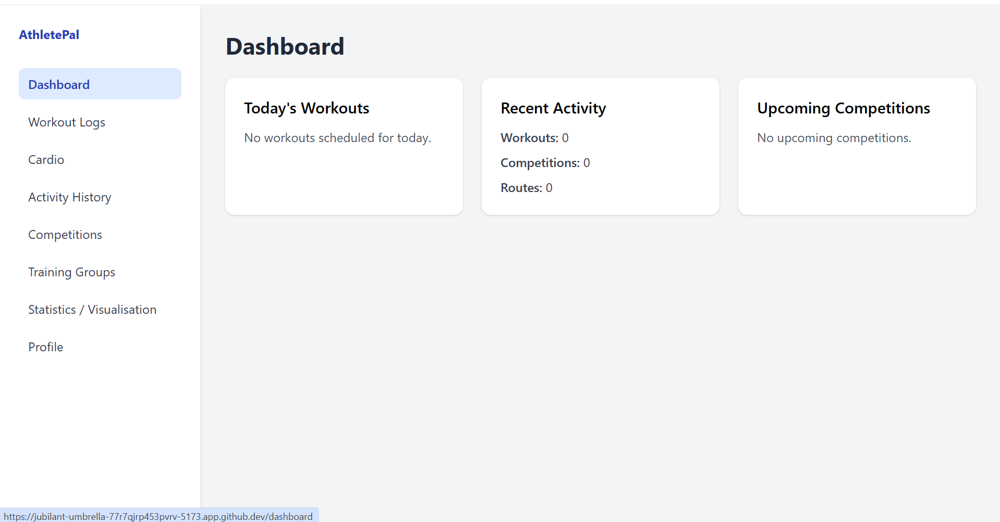
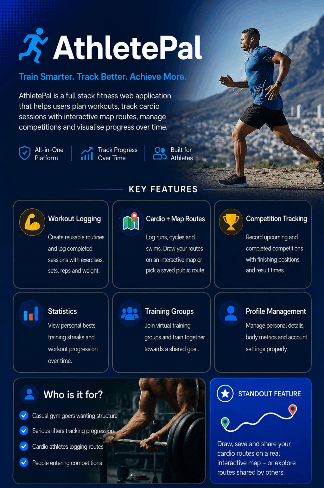
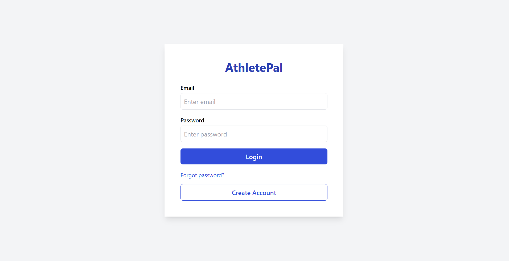
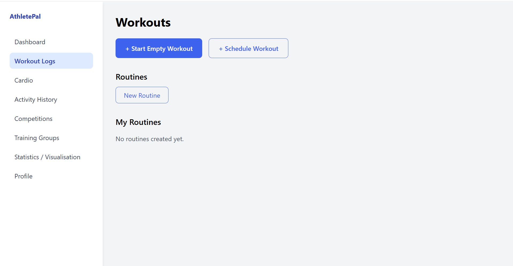
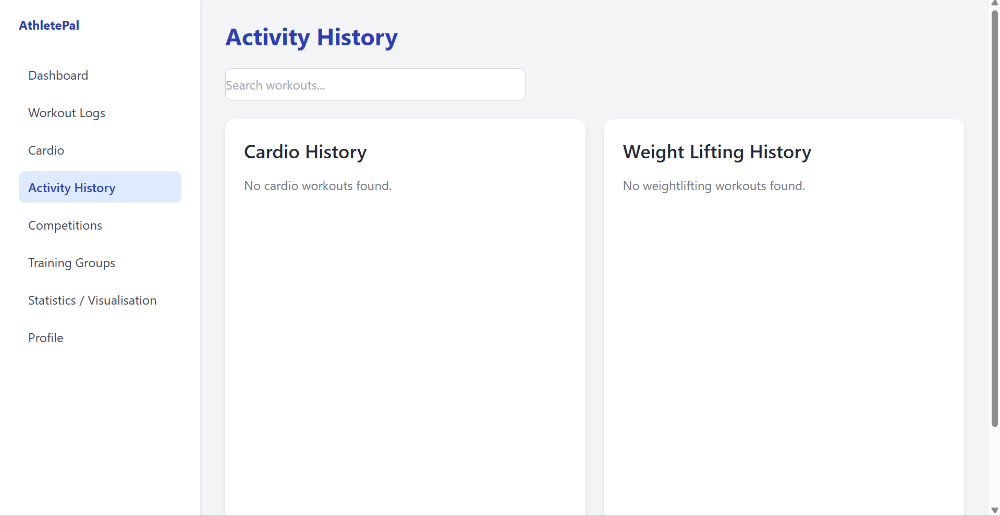
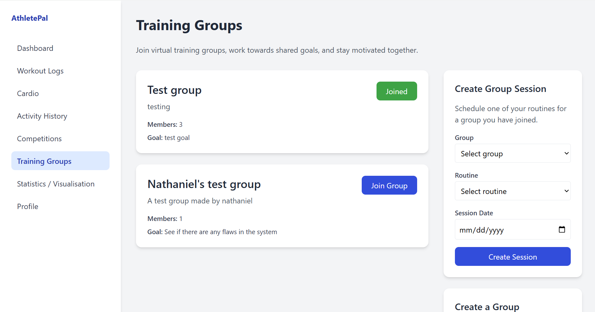
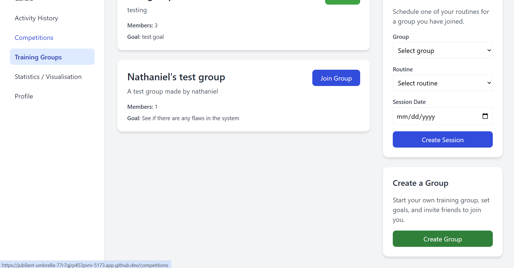
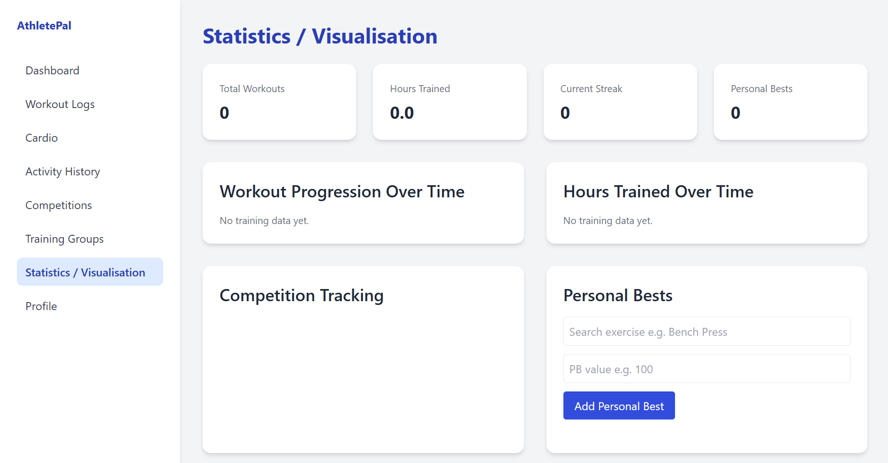

# AthletePal



> **A full-stack fitness tracking platform developed as part of a University of Leeds Software Engineering team project.**

AthletePal is a modern web application designed to help users manage their fitness journey by tracking workouts, cardio sessions, training groups and overall performance through an intuitive and responsive interface.

This repository serves as a portfolio showcase of the project, highlighting the application, the technologies used and my individual contributions as a Frontend Developer.

---

# Overview

AthletePal was developed as part of a collaborative software engineering module at the University of Leeds.

Working within a multidisciplinary team, we designed and developed a complete fitness tracking platform using modern web technologies and Agile software development practices.

The application enables users to:

- 🏋️ Log and manage workouts
- 🏃 Track cardio sessions with interactive route mapping
- 📈 Monitor performance statistics
- 📅 View activity history
- 👥 Join training groups
- 🏆 Participate in fitness competitions
- 👤 Manage personal fitness profiles
- 🔐 Securely authenticate user accounts

---

## Documentation

- 📄 [My Contribution](docs/MyContribution.md)
- ⚙️ [Development Process](docs/Development.md)

---

## Engineering Highlights

- Full-stack web application developed as part of a collaborative software engineering project
- Modern React frontend with Kotlin/Ktor backend
- SQLite database for persistent data storage
- Component-based frontend architecture
- Agile development methodology with sprint planning and retrospectives
- Git feature branching and pull request workflow
- Responsive user interface built with Tailwind CSS
- Interactive route mapping and fitness tracking functionality


# My Contribution

I worked as a **Frontend Developer** throughout the project.

My primary responsibilities included developing and improving several user-facing areas of the application using React.

Areas I contributed to included:

- Dashboard
- Activity History
- Workout Log
- Cardio pages
- Training Groups
- Frontend navigation using React Router
- Responsive user interface implementation
- Frontend integration and testing

Alongside feature development, I collaborated with the wider development team using Git and GitHub, working through feature branches, pull requests and collaborative code integration while following an Agile workflow.

---

# Technology Stack

## Frontend

- React
- Vite
- Tailwind CSS
- React Router

## Backend

- Kotlin
- Ktor

## Database

- SQLite

## Development Tools

- Git
- GitHub
- Visual Studio Code
- IntelliJ IDEA

---

# Software Engineering Experience

This project provided practical experience of working within a collaborative software engineering team.

During development I gained experience with:

- Agile software development
- Sprint planning
- Git version control
- Feature branching
- Pull requests
- Team collaboration
- Frontend architecture
- API integration
- Responsive web development
- Software testing and debugging

---

# Skills Demonstrated

- Frontend Development
- React
- Component-Based Architecture
- Responsive Web Design
- REST API Integration
- Agile Development
- Git & GitHub
- Team Collaboration
- UI/UX Development
- Problem Solving

---

## Repository Structure

```text
AthletePal-Project-Showcase/
├── README.md                  # Project overview
├── images/                    # Screenshots and project poster
│   ├── Dashboard.png
│   ├── WorkoutLog.png
│   ├── ActivityHistory.png
│   ├── LoginPage.png
│   ├── Stats&Visualisation.png
│   ├── TrainingGroups1.png
│   ├── TrainingGroups2.png
│   └── Poster.png
├── docs/
│   ├── MyContribution.md       # My role and responsibilities
│   └── Development.md          # Development process and Agile workflow
```

---

# Project Poster

The project poster summarises the core functionality, architecture and objectives of AthletePal.



---

# Application Preview

## Login



---

## Dashboard


---

## Workout Log



---

## Activity History



---

## Training Groups





---

## Statistics



---

# Reflection

AthletePal was a great opportunity to contribute to a large collaborative software engineering project.

Working alongside other developers strengthened my understanding of how modern software projects are planned, built and maintained. Beyond improving my technical React skills, the project developed my ability to communicate effectively within a team, integrate features across different parts of a system and deliver work against fixed project deadlines.

It also reinforced the importance of writing maintainable code, collaborating through Git workflows and continuously refining features based on feedback throughout the development lifecycle.

---

## What I'd Improve In The Future

If development of AthletePal were to continue, I would focus on:

- Mobile responsiveness improvements
- Real-time notifications
- Wearable device integration
- Improved analytics and visualisations
- Cloud deployment and CI/CD

---

# Repository Purpose

The original AthletePal application was developed as a team project at the University of Leeds.

This repository has been created as a portfolio showcase to demonstrate the project, the technologies used and my personal contributions, and is **not intended to represent sole ownership of the application**.

